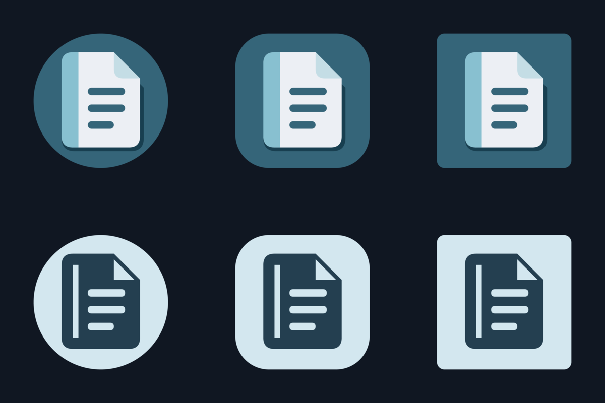

# Etu Android icon

A folded journal with a frost-blue spine on Etu's Nord-inspired teal (`#356579`).



## Assets

- `foreground.svg` and `monochrome.svg`: editable 108 × 108 adaptive-layer sources.
- `foreground.png` and `monochrome.png`: transparent 1024 × 1024 layer exports.
- `icon.svg`: square, full-bleed artwork, framed to match the adaptive launcher crop.
- `play-store.png`: 512 × 512 RGBA, opaque, square Google Play listing icon. Let Play apply its own rounding.
- `preview.png`: circle, rounded-square, and square masks; full color above an example wallpaper-tinted version.

Android uses vector foregrounds and a solid background on API 26+, with a dedicated monochrome layer on API 33+. Earlier versions use the generated 48/72/96/144/192px launcher and round PNGs. The main artwork fits within Android's central 66dp safe circle; backgrounds fill the entire 108dp layer.

## Regenerate

Install ImageMagick 7 and `@resvg/resvg-js-cli` (the `magick` and `resvg-js` commands must be on `PATH`), then run from the repository root:

```sh
python3 assets/android-icon/generate.py
```

The script regenerates the exports and `android/app/src/main/res` icon resources. No font files or runtime dependencies are needed. Rebuild the Android app to see the new launcher icon.
